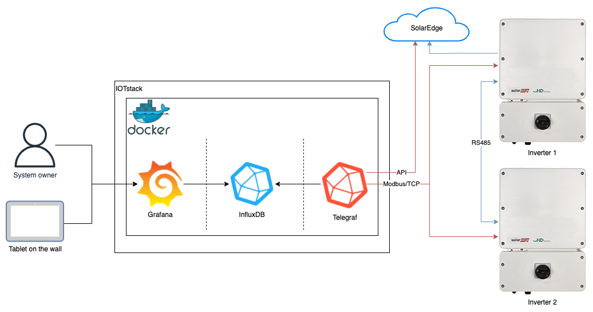
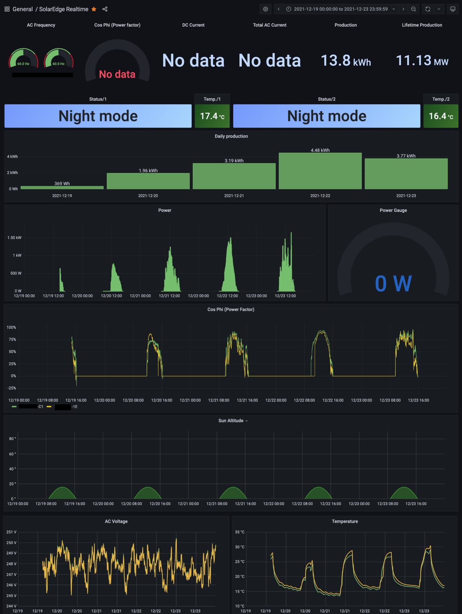

# Monitoring Multi-Inverter SolarEdge Solar Panel Systems

This repository contains a runbook and associated artifacts for monitoring a
[SolarEdge](https://www.solaredge.com/) solar panel system and displaying
relevant performance data on a web-based dashboard.

While there are other resources out there for doing similar, the focus here is
on multi-inverter systems.

For more context and background, please see my blog post
[Monitoring a Multi-Inverter SolarEdge System](https://www.packetmischief.ca/2022/01/09/monitoring-a-multi-inverter-solaredge-system/).

## System Architecture

The solution presented here uses Telegraf, InfluxDB, and Grafana to collect,
store, and display metric data, respectively. Data is collected from SolarEdge
inverters using Modbus/TCP across an IP network.

## Example Dashboard

## Instructions

Read the instructions in the [build runbook](BUILD_RUNBOOK.md) for configuring
the monitoring system.

